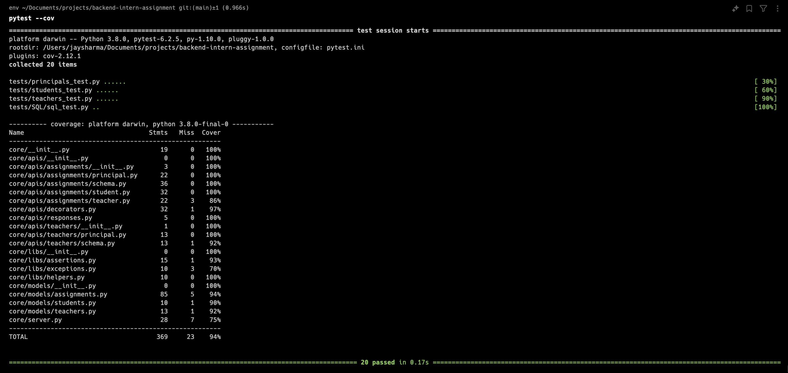

# Backend Intern Assignment Containerisation

## Prerequisites

Make sure you have the following installed on your machine:

- [Docker](https://docs.docker.com/get-docker/)
- [Docker Compose](https://docs.docker.com/compose/install/)

## To Start the server

Open a terminal in the directory of the project.
Run : docker-compose up --build 
 
//Server will be running on port 7755 which is exposed through the Dockerfile

## Some extra scripts have been added to reset the database and runTests

runTests.sh : resets the database and runs all the testcases 
 
resetDB.sh : resets the database

## Test case execution
